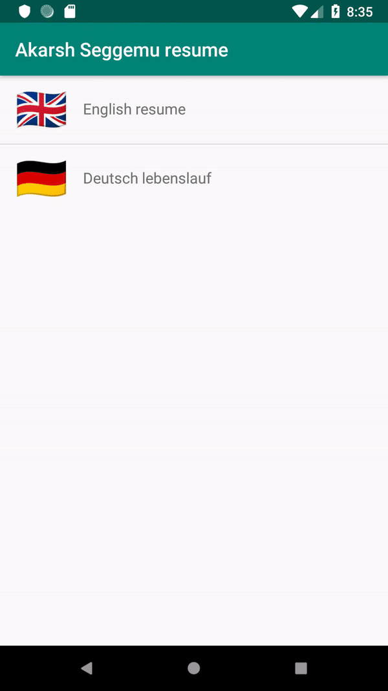

# Android - Resume application project

This project is developed to show the resume in Android.
The resume is maintained in a JSON format following resume JSON structure.

## Table of Contents

  - [Features](#features)
  - [Requirements](#requirements)
  - [License](#license)

## Features

- [x] Download a remote JSON file in the application.
- [x] Before storing the remote JSON file in the application the following checks are performed, 
    - [x] If the application is running on an emulator or a mobile device.
    - [x] If external storage (SD card) is present and it is removable.
- [x] Store the downloaded remote JSON file in the application.
- [x] Read the stored JSON file in the application.
- [x] Pass data from resume schema layout to other layouts.
- [x] Translate the contents in the application based on the resume language selected by the user.
- [x] Application adapts to different screen sizes.
- [x] Continuous Integration (Travis-CI) to test the application.

## Requirements

- Android 16+
- Android Studio 3+
- Java 1.8

#### License

Resume application project is released under the GNU General Public License v3.0 license. [See LICENSE](https://github.com/akarsh/akarsh-seggemu-resume/blob/master/LICENSE) for details.
